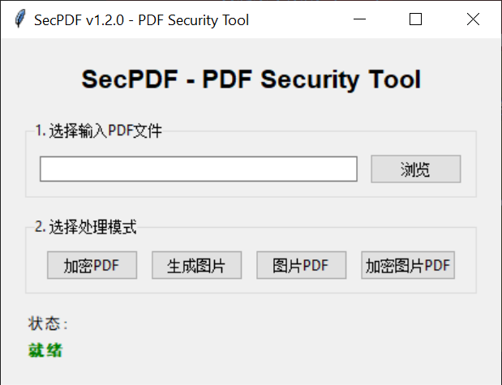

<div align="center">

# 📄 SecPDF - PDF文件安全处理工具

[](https://github.com/anyshpm/secpdf/releases)
[](https://github.com/anyshpm/secpdf/releases)
[](LICENSE)
[](https://www.python.org/downloads/)

[](https://github.com/anyshpm/secpdf/releases)
[](https://github.com/anyshpm/secpdf/releases)
[](https://github.com/anyshpm/secpdf/releases)

[](https://github.com/anyshpm/secpdf/actions)

**一款强大的 PDF 安全处理工具，支持加密、转图片、防复制等多种保护模式**

[下载最新版本](https://github.com/anyshpm/secpdf/releases) · [查看文档](#使用方法) · [报告问题](https://github.com/anyshpm/secpdf/issues)

</div>

---

## ✨ 功能特点

### 🔒 四种安全处理模式

| 模式 | 功能 | 适用场景 |
|------|------|----------|
| 🔐 **加密 PDF** | 为普通 PDF 添加密码保护 | 需要限制访问权限的文档 |
| 🖼️ **生成图片** | 将 PDF 每页转换为 PNG 图片 | 需要查看格式转换或归档 |
| 📑 **图片 PDF** | 生成图片内容 PDF（防文字复制） | 防止内容被轻易复制的文档 |
| 🔒 **加密图片 PDF** | 图片 PDF + 密码（双重保护） | 最高级别安全保护 |

### 🚀 核心优势

- **全内存操作**：所有处理在内存中完成，不产生临时文件
- **跨平台支持**：Windows、Linux、macOS 全平台覆盖
- **多种架构**：支持 x64、x86、ARM64、ARMv7 等多种架构
- **双界面**：提供命令行（CLI）和图形界面（GUI）两种使用方式
- **绿色免安装**：下载即可使用，无需安装 Python 环境

---

## 📦 下载安装

### Windows 用户

```powershell
# 1. 从 [Releases](https://github.com/anyshpm/secpdf/releases) 页面下载最新版本
# 2. 解压到任意目录
# 3. 双击运行 secpdf-gui.exe 使用图形界面
# 4. 或在命令行中使用 secpdf.exe
```

### Linux 用户

```bash
# 1. 下载对应架构的可执行文件
wget https://github.com/anyshpm/secpdf/releases/latest/download/secpdf_<version>_linux_amd64

# 2. 添加执行权限
chmod +x secpdf_<version>_linux_amd64

# 3. 移动到 PATH 目录（可选）
sudo mv secpdf_<version>_linux_amd64 /usr/local/bin/secpdf
```

### macOS 用户

```bash
# 1. 下载对应架构的可执行文件
# 2. 添加执行权限
chmod +x secpdf_<version>_darwin_amd64

# 3. 移动到 PATH 目录（可选）
sudo mv secpdf_<version>_darwin_amd64 /usr/local/bin/secpdf
```

---

## 📸 界面预览



---

## 🎯 使用方法

### 图形界面（GUI）

双击运行 `secpdf-gui.exe`（Windows）或对应的可执行文件

**操作步骤：**
1. 选择要处理的 PDF 文件
2. 点击对应的处理模式按钮
3. 根据提示输入密码（加密模式）或选择输出路径
4. 等待处理完成

### 命令行界面（CLI）

```bash
# 查看帮助
secpdf --help

# 查看版本
secpdf --version
```

#### 基本用法

```bash
secpdf <模式> <输入PDF> <输出路径> [密码]
```

#### 模式示例

**1. 加密 PDF 文件**
```bash
secpdf encrypt input.pdf encrypted.pdf mypassword
```

**2. PDF 转图片**
```bash
secpdf images input.pdf output_images/
```

**3. 生成图片内容 PDF（防复制）**
```bash
secpdf image-pdf input.pdf protected.pdf
```

**4. 生成加密图片 PDF（双重保护）**
```bash
secpdf encrypt-image-pdf input.pdf final.pdf mypassword
```

---

## 🔧 高级功能

### Windows 右键菜单集成（TODO）

计划在 Windows 上可将 secpdf 集成到 PDF 文件的右键菜单中，实现快速处理。

---

## 🛠️ 技术架构

### 处理流程

```
PDF 输入
    ↓
读取到内存
    ↓
┌─────────────────┐
│  处理模式选择    │
└─────────────────┘
    ├─→ [加密模式] → 内存加密 → 输出
    ├─→ [图片模式] → 转换图片 → 输出
    ├─→ [图片PDF]  → 转图片 → 合并PDF → 输出
    └─→ [双重保护] → 转图片 → 合并PDF → 加密 → 输出
```

### 核心技术

- **PyMuPDF (fitz)**：高性能 PDF 解析与渲染
- **Pillow**：强大的图片处理库
- **pypdf**：PDF 加密与操作
- **Tkinter**：跨平台 GUI 框架

---

## 📊 构建状态

| 平台 | 架构 | 状态 |
|------|------|------|
| Windows | x64 | ✅ |
| Windows | x86 | ✅ |
| Linux | x64 | ✅ |
| Linux | ARM64 | ✅ |
| Linux | ARMv7 | ✅ |
| macOS | Intel (x64) | ✅ |
| macOS | Apple Silicon (ARM64) | ✅ |

---

## ⚠️ 注意事项

- **内存占用**：大文件处理会占用较多内存，建议在内存充足的设备上使用
- **文件格式**：仅支持标准 PDF 格式文件
- **密码安全**：请妥善保管设置的密码，遗忘将无法找回
- **文字选择**：图片 PDF 模式下的文档无法直接复制文字内容

---

## 🤝 贡献

欢迎提交 Issue 和 Pull Request！

## 📄 开源协议

本项目采用 [MIT License](LICENSE) 开源协议

---

<div align="center">

**如果这个项目对你有帮助，请给它一个 ⭐️ Star**

</div>